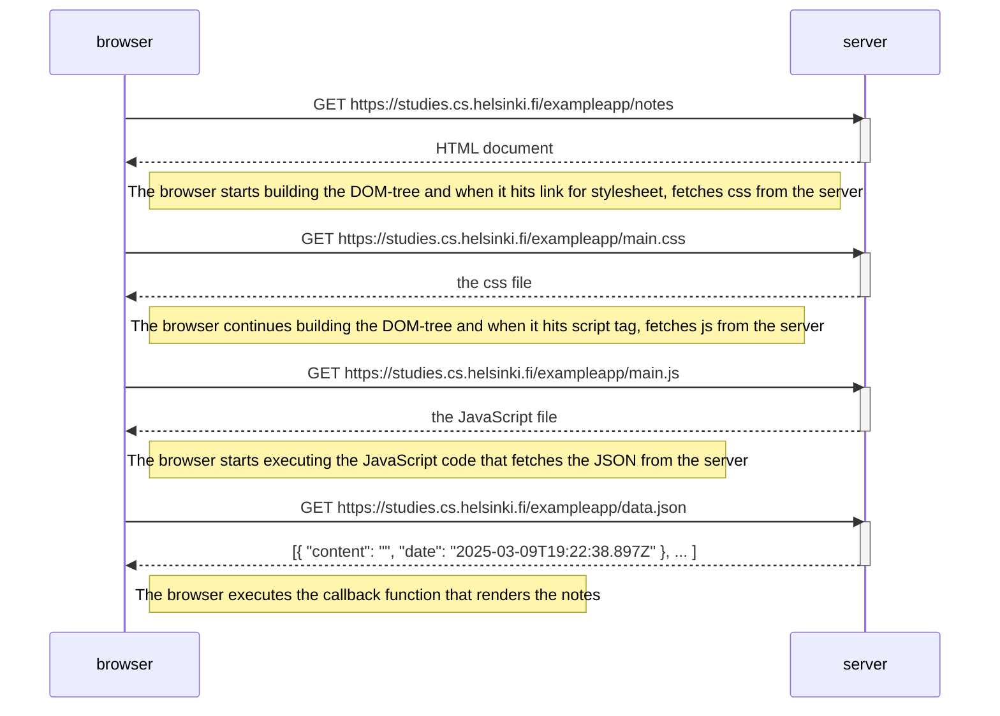

```mermaid
sequenceDiagram

    participant browser
    participant server

    browser->>server: GET https://studies.cs.helsinki.fi/exampleapp/notes
    activate server
    server-->>browser: HTML document
    deactivate server

     Note right of browser: The browser starts building the DOM-tree and when it hits link for stylesheet, fetches css from the server

    browser->>server: GET https://studies.cs.helsinki.fi/exampleapp/main.css
    activate server
    server-->>browser: the css file
    deactivate server

    Note right of browser: The browser continues building the DOM-tree and when it hits script tag, fetches js from the server

    browser->>server: GET https://studies.cs.helsinki.fi/exampleapp/main.js
    activate server
    server-->>browser: the JavaScript file
    deactivate server

    Note right of browser: The browser starts executing the JavaScript code that fetches the JSON from the server

    browser->>server: GET https://studies.cs.helsinki.fi/exampleapp/data.json
    activate server
    server-->>browser: [{ "content": "", "date": "2025-03-09T19:22:38.897Z" }, ... ]
    deactivate server

    Note right of browser: The browser executes the callback function that renders the notes
```
